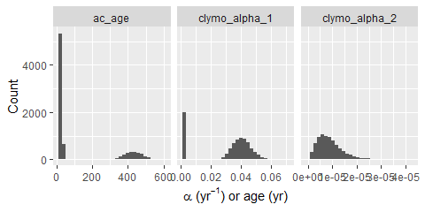
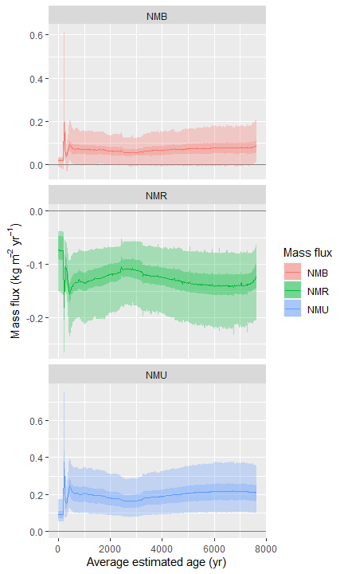

<!-- README.md is generated from README.Rmd. Please edit that file -->

# peathamstr

<!-- badges: start -->

[](https://lifecycle.r-lib.org/articles/stages.html#experimental)
<!-- badges: end -->

‘peathamstr’ extents the
[‘hamstr’](https://github.com/EarthSystemDiagnostics/hamstr) package
(Hierarchical Accumulation Modelling with Stan and R) (Dolman 2023) with
a modified version of Clymo’s Bog Growth Model (Clymo 1984).

The extension uses ‘hamstr’ to compute an age-depth model, but also
estimates layer-specific peat addition rates to the catotelm (PAR) and a
global exponential decomposition rate. In addition, peat mass fluxes net
carbon uptake (NCU) and net carbon release (NCR) as defined in Yu (2011)
are computed.

This allows to estimate catotelm PAR and decomposition rates also for
peat cores where the assumption of a constant PAR of Clymo’s Bog Growth
Model (Clymo 1984) is violated, e.g. when PAR declined over time (see
for example Yu et al. (2003)).

The package shamelessly recycles much of the code from the
[‘hamstr’](https://github.com/EarthSystemDiagnostics/hamstr) package and
much credit goes to its developers. When using ‘peathamstr’, do not
forget to also cite the ‘hamstr’ package!

## Installation

You can install the development version of ‘peathamstr’ like so:

``` r
remotes::install_github("henningte/peathamstr")
```

## Example

This example shows how to estimate the decomposition rate, net carbon
uptake (NCU) and net carbon release (NCR) for a peat core with
non-constant peat addition rate (PAR).

``` r
library(peathamstr)
library(rstan)
#> Loading required package: StanHeaders
#> 
#> rstan version 2.26.22 (Stan version 2.26.1)
#> For execution on a local, multicore CPU with excess RAM we recommend calling
#> options(mc.cores = parallel::detectCores()).
#> To avoid recompilation of unchanged Stan programs, we recommend calling
#> rstan_options(auto_write = TRUE)
#> For within-chain threading using `reduce_sum()` or `map_rect()` Stan functions,
#> change `threads_per_chain` option:
#> rstan_options(threads_per_chain = 1)
#> Do not specify '-march=native' in 'LOCAL_CPPFLAGS' or a Makevars file
library(magrittr)
#> 
#> Attaching package: 'magrittr'
#> The following object is masked from 'package:rstan':
#> 
#>     extract
library(pangaear) # to download example data
#> Registered S3 method overwritten by 'httr':
#>   method           from  
#>   print.cache_info hoardr
library(ggplot2)
```

Download and reshape data (Yu 2018b, 2018a) from the Pangaea database:

``` r
d1 <- pangaear::pg_data(doi = '10.1594/PANGAEA.890357')
#> Downloading 1 datasets from 10.1594/PANGAEA.890357
#> Processing 1 files
d2 <- pangaear::pg_data(doi = '10.1594/PANGAEA.890392')
#> Downloading 1 datasets from 10.1594/PANGAEA.890392
#> Processing 1 files

d <- 
  dplyr::full_join(
    d1[[1]]$data |>
      dplyr::select(1, 3, 6) |>
      setNames(nm = c("depth_midpoint", "bulk_density", "C")) |>
      dplyr::filter(!is.na(bulk_density)) |>
      dplyr::mutate(
        C = C/bulk_density,
        depth_midpoint = round(depth_midpoint * 100, 1), # assumed
        thickness = 1, # assumed
        mass = bulk_density * thickness * 10000/1000,
        cumulative_mass = c(cumsum(mass))
      ),
    d2[[1]]$data |>
      dplyr::select(2, 4, 5) |>
      setNames(nm = c("depth_midpoint", "age", "age_sd")) |>
      dplyr::filter(!is.na(age)) |>
      dplyr::mutate(
        depth_midpoint = round(depth_midpoint * 100, 1),
        age = age * 1000,
        age_sd = age_sd * 1000
      ) |>
      hamstr::calibrate_14C_age(age.14C = "age", age.14C.se = "age_sd") |>
      dplyr::select(-age, -age_sd) |>
      dplyr::rename(
        age = "age.14C.cal",
        age_sd = "age.14C.cal.se"
      ),
    by = "depth_midpoint"
  ) |>
  dplyr::arrange(depth_midpoint) |>
  dplyr::filter(depth_midpoint <= max(depth_midpoint[!is.na(age)]) & depth_midpoint >= 0) |>
  dplyr::mutate(
    depth_upper = depth_midpoint - 0.5,
    depth_lower = depth_midpoint + 0.5
  )

# set.seed(23)
# d <- 
#   dplyr::bind_rows(
#     d |>
#       dplyr::filter(! is.na(age)),
#     d |>
#       dplyr::filter(is.na(age)) |>
#       dplyr::slice_sample(n = floor(nrow(d)/3), replace = FALSE)
#   ) |>
#   dplyr::arrange(depth_upper)

# summarize the data to make the example faster to compute
# target_depths <- 
#   tibble::tibble(
#     sample_depth_upper = c(seq(min(d$depth_upper), 60, by = 2), seq(60, max(d$depth_lower), by = 20)),
#     sample_depth_lower = c(sample_depth_upper[-1], max(d$depth_lower)) 
#   )

# d <- 
#   dplyr::bind_rows(
#     d |>
#       dplyr::filter(!is.na(age)),
#     d |>
#       dplyr::filter(is.na(age)) %>%
#       dplyr::mutate(
#         index_target_depth =
#           purrr::map_int(seq_len(nrow(.)), function(i) {
#             index <- depth_lower[[i]] <= target_depths$sample_depth_lower & depth_upper[[i]] >= target_depths$sample_depth_upper
#             if(sum(index) == 0) {
#               NA_integer_
#             } else {
#               which(index)[[1]]
#             }
#           })
#       ) |>
#       dplyr::group_by(index_target_depth) |>
#       dplyr::summarise(
#         dplyr::across(!dplyr::all_of(c("depth_upper", "depth_lower", "depth_midpoint", "cumulative_mass", "mass", "thickness")), mean),
#         depth_upper = min(depth_upper),
#         depth_lower = max(depth_lower),
#         mass = sum(mass),
#         cumulative_mass = max(cumulative_mass),
#         .groups = "drop"
#       )
#   ) |>
#   dplyr::mutate(
#     thickness = depth_lower - depth_upper,
#     depth_midpoint = depth_upper + (thickness) * 0.5
#   ) |>
#   dplyr::select(-index_target_depth) |>
#   dplyr::arrange(depth_upper)
```

Show the cumulative mass-age curve (here using only point age values and
cumulative masses for dated layers). It is clearly visible that the core
violates the assumptions of the original Bog Growth Model (see also Yu
et al. (2003) for a detailed description of the peatland).

``` r
d |>
  dplyr::filter(!is.na(age)) |>
  ggplot(aes(y = cumsum(mass * C), x = age)) +
  geom_path() +
  geom_point() +
  labs(y = expression("Cumulative carbon mass (kg m"^{-2}*")"), x = "age (yr BP)")
```


Estimate the posterior distribution (computes the age-depth model and
fits the modified Clymo model with PAR varying over time).

``` r
fit_1 <- 
  peat_hamstr(
    K = c(3, 3, 3),
    depth = 
      d |> 
      dplyr::filter(!is.na(age)) |> 
      dplyr::pull(depth_midpoint),
    obs_age =
      d |> 
      dplyr::filter(!is.na(age)) |> 
      dplyr::pull(age),
    obs_err = 
      d |> 
      dplyr::filter(!is.na(age)) |> 
      dplyr::pull(age_sd),
    layer_mass = 
      d |> 
      dplyr::filter(is.na(age)) |>
      dplyr::filter(!is.na(mass)) |> 
      dplyr::pull(cumulative_mass),
    cumulative_mass0 = d$cumulative_mass[[1]] - d$mass[[1]],
    # depth2 =
      # d |> 
      # dplyr::filter(!is.na(cumulative_mass)) |> 
      # dplyr::pull(depth_midpoint),
    depth_clymo_par_constant = 10,
    depth2_upper =
      d |> 
      dplyr::filter(is.na(age)) |>
      dplyr::filter(!is.na(cumulative_mass)) |> 
      dplyr::pull(depth_upper),
    depth2_lower =
      d |> 
      dplyr::filter(is.na(age)) |>
      dplyr::filter(!is.na(cumulative_mass)) |> 
      dplyr::pull(depth_lower),
    min_age = 0,
    top_depth = 0,
    bottom_depth = max(d$depth_lower),
    p1_clymo_par = 8,
    p2_clymo_par = 8/0.2,
    p3_clymo_par = 1/20,
    clymo_par_memory_p1 = 2,
    clymo_par_memory_p2 = 2,
    p1_clymo_alpha_1 = 10, 
    p2_clymo_alpha_1 = 10/0.04, 
    p3_clymo_alpha_1 = 1/100,
    p1_age0 = 20,
    p2_age0 = 20/0.2,
    p3_age0 = 1/20,
    p1_ac_age = 20,
    p2_ac_age = 20/200,
    p3_ac_age = 40,
    # the seed argument for the sampler is set here so that
    # this example always returns the same numerical result
    stan_sampler_args = 
      list(
        seed = 34564, 
        chains = 4, 
        iter = 4000, 
        cores = 4, 
        control = list(max_treedepth = 15)
      )
  )
#> Warning: The largest R-hat is 2.03, indicating chains have not mixed.
#> Running the chains for more iterations may help. See
#> https://mc-stan.org/misc/warnings.html#r-hat
#> Warning: Bulk Effective Samples Size (ESS) is too low, indicating posterior means and medians may be unreliable.
#> Running the chains for more iterations may help. See
#> https://mc-stan.org/misc/warnings.html#bulk-ess
#> Warning: Tail Effective Samples Size (ESS) is too low, indicating posterior variances and tail quantiles may be unreliable.
#> Running the chains for more iterations may help. See
#> https://mc-stan.org/misc/warnings.html#tail-ess
```

Show the age-depth model (this is the same function as in the original
‘hamstr’ package):

``` r
plot(fit_1, type = "default")
```


Show estimated and measured cumulative masses versus depth:

``` r
# plot(fit_1, type = "cumulative_mass_profile")
plot(
  fit_1, 
  type = "cumulative_mass_profile"
)
#> Warning: Returning more (or less) than 1 row per `summarise()` group was deprecated in
#> dplyr 1.1.0.
#> ℹ Please use `reframe()` instead.
#> ℹ When switching from `summarise()` to `reframe()`, remember that `reframe()`
#>   always returns an ungrouped data frame and adjust accordingly.
#> ℹ The deprecated feature was likely used in the peathamstr package.
#>   Please report the issue at <https://github.com/henningte/peathamstr/issues>.
#> This warning is displayed once every 8 hours.
#> Call `lifecycle::last_lifecycle_warnings()` to see where this warning was
#> generated.
```


Plot a histogram of the estimate exponential decomposition rates for the
acrotelm and catotelm and of the acrotelm-catotelm boundary age:

``` r
as.data.frame(fit_1$fit, pars = c("clymo_alpha_1", "clymo_alpha_2", "ac_age")) |>
  tidyr::pivot_longer(
    cols = dplyr::everything(),
    names_to = "variable",
    values_to = "value"
  ) |>
  ggplot(aes(x = value)) +
  geom_histogram(bins = 30) +
  labs(y = "Count", x = expression(alpha~"("*yr^{-1}*") or age (yr)")) +
  facet_wrap(~ variable, scales = "free_x")
```



Plot for net mass uptake (NMU) and net mass release (NMR) can also be
created:

``` r
plot(fit_1, type = "mass_fluxes") + 
  facet_wrap(~ variable, ncol = 1L, scales = "free_y")
```



# References

<div id="refs" class="references csl-bib-body hanging-indent">

<div id="ref-Clymo.1984" class="csl-entry">

Clymo, R S. 1984. “The Limits to Peat Bog Growth.” *Philosophical
Transactions of the Royal Society of London. Series B, Biological
Sciences* 303 (1117): 51.

</div>

<div id="ref-Dolman.2023" class="csl-entry">

Dolman, Andrew. 2023. “<span class="nocase">hamstr</span>: Hierarchical
Accumulation Modelling with Stan and R.”

</div>

<div id="ref-Yu.2011" class="csl-entry">

Yu, Zicheng. 2011. “Holocene Carbon Flux Histories of the World’s
Peatlands: Global Carbon-Cycle Implications.” *The Holocene* 21 (5):
761–74. <https://doi.org/10.1177/0959683610386982>.

</div>

<div id="ref-Yu.2018a" class="csl-entry">

———. 2018a. “Age Determination of Upper\_Pinto Peat Core.” PANGAEA.
<https://doi.org/10.1594/PANGAEA.890392>.

</div>

<div id="ref-Yu.2018" class="csl-entry">

———. 2018b. “Geochemistry of Upper\_Pinto Peat Core.” PANGAEA.
<https://doi.org/10.1594/PANGAEA.890357>.

</div>

<div id="ref-Yu.2003" class="csl-entry">

Yu, Zicheng, Dale H Vitt, Ian D Campbell, and Michael J Apps. 2003.
“Understanding Holocene Peat Accumulation Pattern of Continental Fens in
Western Canada.” *Can. J. Bot.* 81: 16.

</div>

</div>
